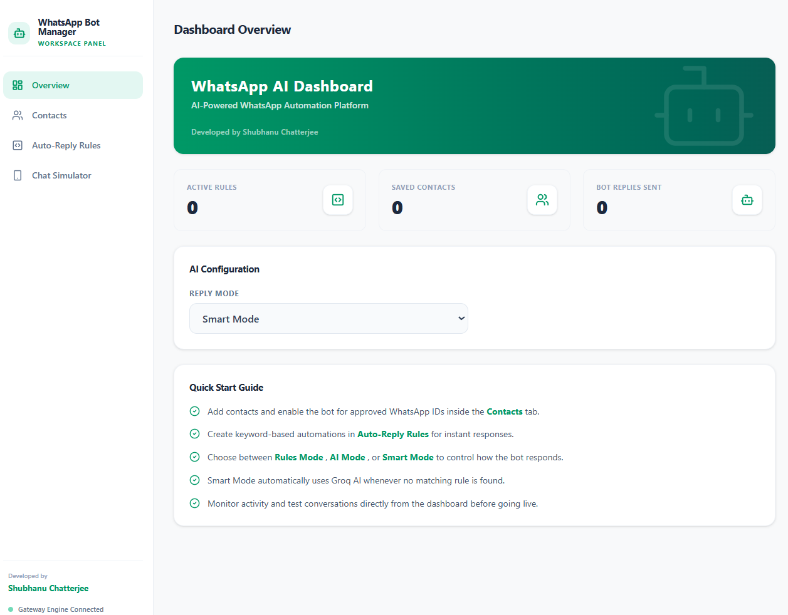
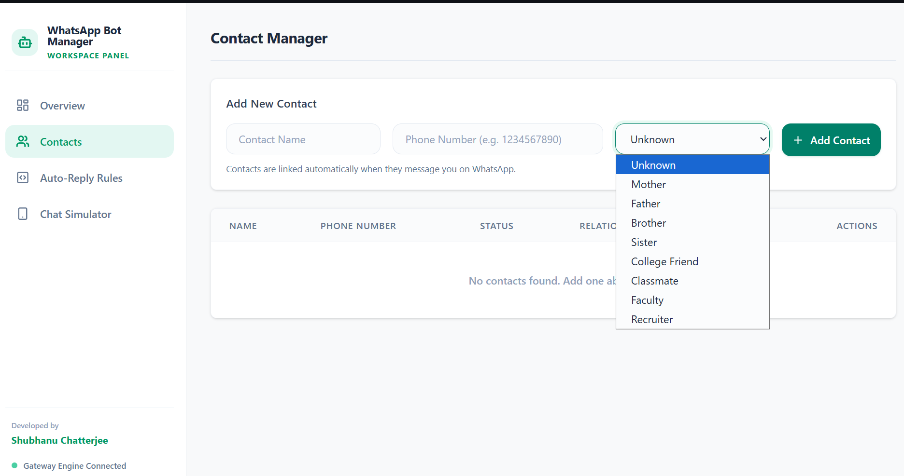
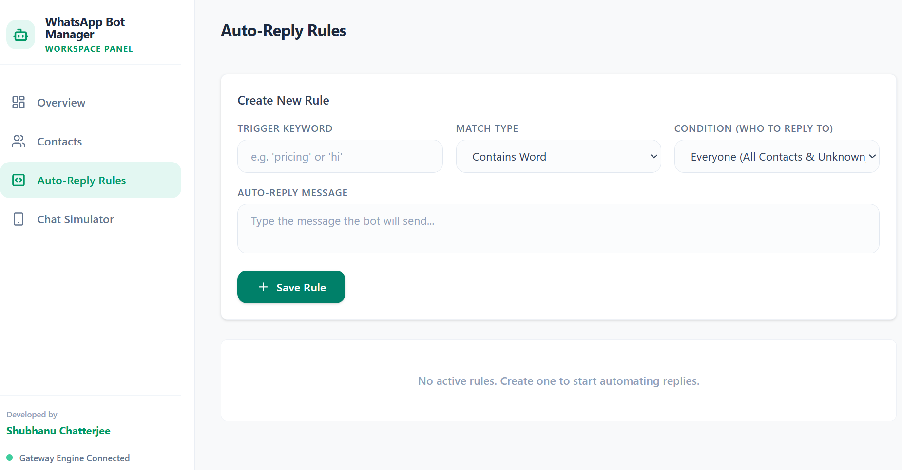
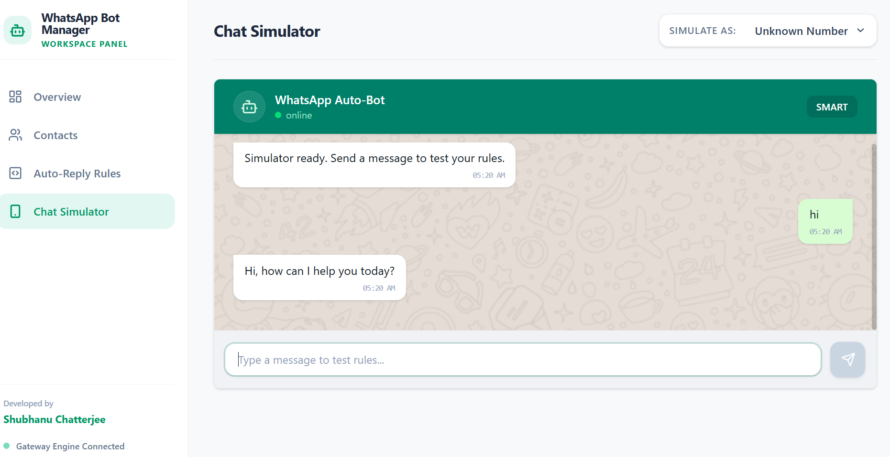

# WhatsApp AI Auto-Reply Dashboard

A personal project built to automate WhatsApp conversations using AI and rule-based responses through a custom dashboard.

## Overview

This project combines WhatsApp Web automation with Groq AI to create an intelligent auto-reply system. The dashboard allows management of contacts, auto-reply rules, AI response modes, and conversation testing through a WhatsApp-inspired interface.

## Features

* WhatsApp Web integration
* AI-powered responses using Groq
* Rule-based auto replies
* Smart Mode (Rules + AI fallback)
* Contact management system
* Allowed contacts whitelist
* Chat simulator for testing
* Context-aware AI memory
* Real-time dashboard controls

## Tech Stack

### Frontend

* React
* Vite
* Tailwind CSS
* Lucide React

### Backend

* Node.js
* Express
* Groq SDK
* whatsapp-web.js

## Why I Built This

I wanted to explore how AI assistants can be integrated into messaging platforms while maintaining control through a custom dashboard. The project also helped me gain experience with API integrations, frontend/backend communication, state management, and automation workflows.

## Challenges Solved

* Managing WhatsApp authentication sessions
* Creating a rule engine for automated replies
* Integrating AI-generated responses
* Maintaining conversation context across messages
* Synchronizing dashboard settings with backend services

## Future Improvements

* Persistent chat memory database
* Message scheduling
* Media response support
* Docker deployment

## Screenshots

# WhatsApp AI Dashboard

## Dashboard



## Contact Management



## Rules Engine



## Chat Simulator




## Getting Started

### 1. Clone the Repository

```bash
git clone https://github.com/YOUR_USERNAME/whatsapp-dashboard.git
cd whatsapp-dashboard
```

### 2. Install Dependencies

```bash
npm install
```

### 3. Create Environment Variables

Create a `.env` file in the project root:

```env
GROQ_API_KEY=your_groq_api_key

DATA_DIR=C:/Users/YOUR_USERNAME/wa-data
AUTH_DIR=C:/Users/YOUR_USERNAME/wa-auth

BROWSER_PATH=C:/Program Files/BraveSoftware/Brave-Browser/Application/brave.exe
```

Adjust the paths to match your system.

### 4. Start the Backend

```bash
npm run server
```

### 5. Start the Frontend

Open a second terminal:

```bash
npm run dev
```

### 6. Open the Dashboard

Navigate to:

```text
http://localhost:5173
```

### 7. Link WhatsApp

On the first run:

1. A QR code will appear in the backend terminal.
2. Open WhatsApp on your phone.
3. Go to **Settings → Linked Devices**.
4. Tap **Link a Device**.
5. Scan the QR code.

The login session is stored locally, so you normally only need to scan once.

### 8. Configure the Bot

* Add contacts to the allowlist.
* Create custom reply rules.
* Choose a reply mode:

  * **Rules** → Rule-based replies only
  * **AI** → Groq AI replies only
  * **Smart** → Rules first, AI fallback

### 9. Test the Bot

Send a message from an allowed contact and verify the bot responds according to the selected mode.

## Build for Production

```bash
npm run build
```

A successful build generates the production files in the `dist/` directory.


## Author

Shubhanu Chatterjee
